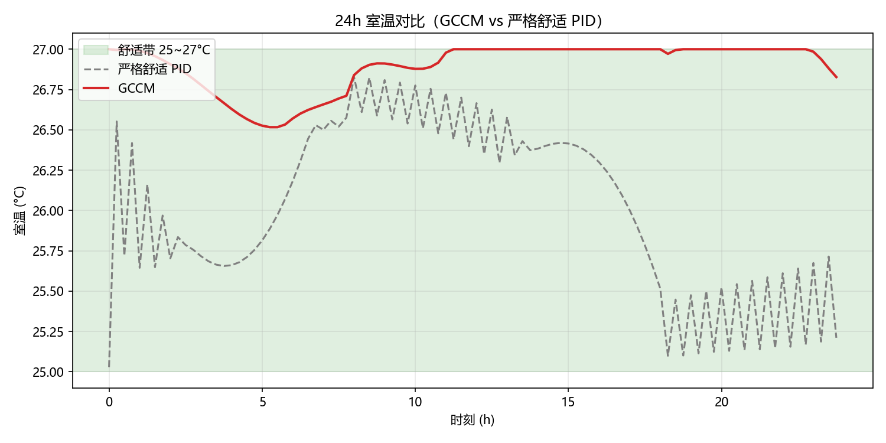
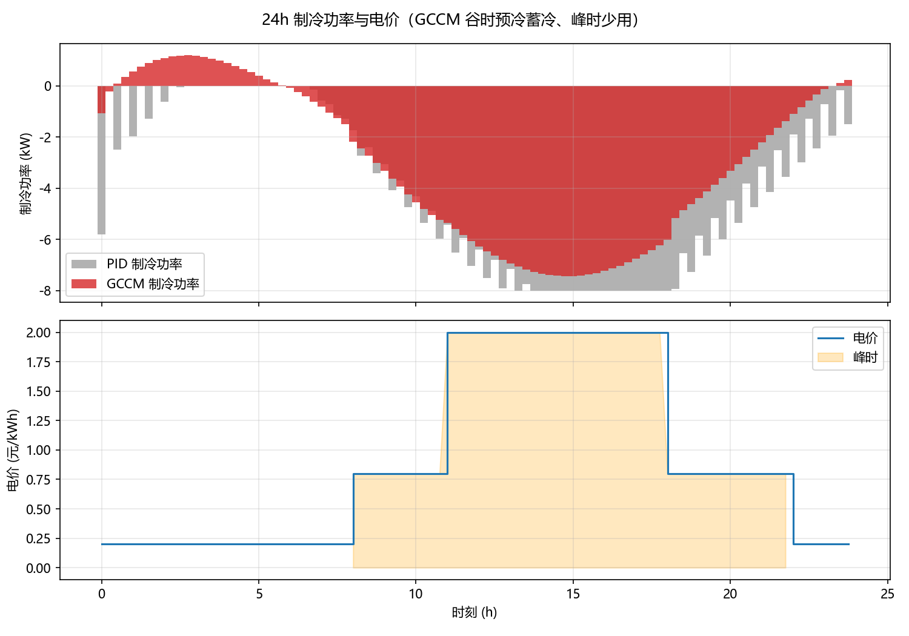
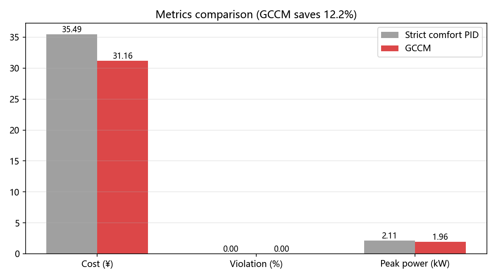
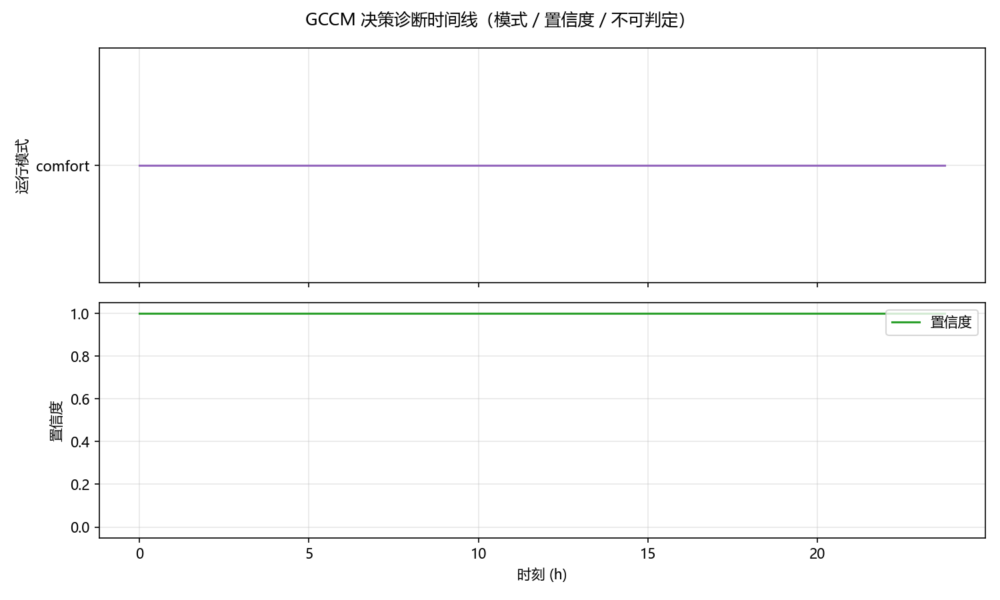
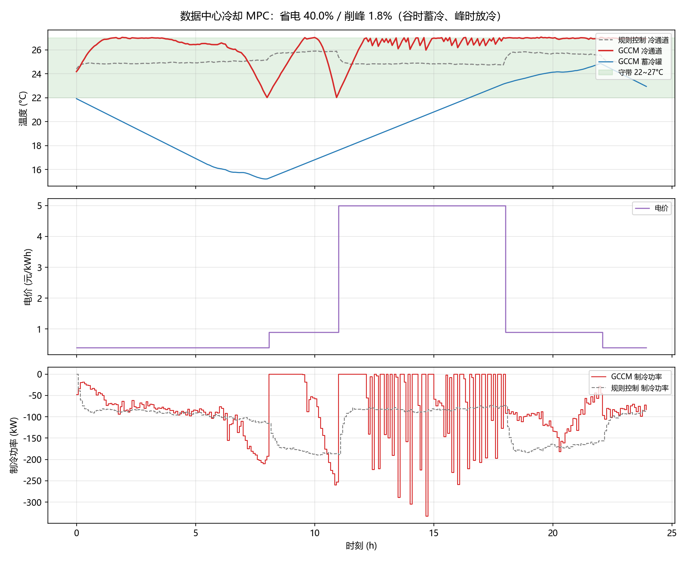

# GCCM-BE — Geometry-based Causal Control Model for Building Energy

> **English | [中文](README.zh-CN.md)**

A **rolling-horizon Model Predictive Control (MPC) engine with a safety degradation chain** for building HVAC and data center cooling optimization. Pure Python (numpy/scipy), with optional CasADi backend, deployable on edge devices.

> Positioning note: "geometry/causal" in the name refers to a **discrete-time least-action path approximation + causality-inspired adaptive control** (see [docs/RIEMANNIAN_CONTROL_THEORY.md](docs/RIEMANNIAN_CONTROL_THEORY.md)). This is **not** strict Riemannian geodesic solving or statistical causal inference — we stay honest and reproducible about what is claimed.

## ✨ Features

- **Rolling-horizon MPC**: anticipates weather and electricity prices — pre-cools during cheap hours, shaves peaks (building HVAC **and** data center cooling)
- **Safety degradation chain**: automatically falls back to model-free safe control when the solver fails / model mismatches / prediction error spikes — never loses control
- **Explainable decisions**: every control step outputs confidence, undecidable flags, and counterfactual comparison reports
- **Online adaptation**: RC parameter identification (with physical plausibility gating + shadow-prediction validation), self-monitoring (AR(1) self-prediction)
- **Robust MPC**: multi-scenario shared control; under model mismatch it clearly beats classic MPC (violation 64.6% → 32.3%)
- **Storage value term**: prevents myopic draining of thermal/cold storage (general energy-storage scheduling, applicable to batteries/DHW/ice tanks)
- **Lightweight deployment**: thread-safe REST API + JSON configuration + Dockerfile

## 🏗️ Architecture

```text
┌─────────────────────────────────────────────┐
│ Application: REST API / config / report      │  gccm_be/app
├─────────────────────────────────────────────┤
│ Decision & diagnosis: confidence/undecidable │  gccm_be/decision
│   / counterfactual / triggers                │
├─────────────────────────────────────────────┤
│ Normative: modes / weights / context labels  │  gccm_be/normative
├─────────────────────────────────────────────┤
│ Geometry: energy landscape / metric /        │  gccm_be/geometry
│   geodesic solver / curvature                │
├─────────────────────────────────────────────┤
│ Physics: RC models / data center cooling /   │  gccm_be/physics
│   online identification                      │
└─────────────────────────────────────────────┘
           Top-level orchestration: GCCMEngine (engine.py)
```

Data flow: physics provides state transition → normative provides parameters → geometry solves MPC → decision supervises/degrades → app exposes the interface.

## 🚀 Quick Start

```bash
pip install numpy scipy            # runtime deps only
pip install -e .                   # or simply use PYTHONPATH=.

# Minimal demo: single-zone 24h closed loop
PYTHONPATH=. python3 examples/demo.py

# Baselines comparison: rule / PID / GCCM
PYTHONPATH=. python3 examples/compare_baselines.py --horizon 48 --no-plot

# REST API
python -m gccm_be.app.api --config examples/config.json
# → GET /health  /status   POST /control  {"state":[...], "labels":[...]}
```

## 📊 Measured Results

> All numbers are re-measured after the pipeline fixes (2026-08-16); baselines, scenarios, and seeds are documented and reproducible.

### Building, single zone (fair_compare, 24h, 25~27°C)

| Method | Cost (¥) | Violation (%) | Peak (kW) |
|---|---:|---:|---:|
| Strict comfort PID | 28.70 | 0.0 | 2.11 |
| **GCCM** | **24.86** | **0.0** | 1.96 |

**13.4% cost savings at 0% violation**; the Pareto-optimal configuration (energy=0.8, margin=0.3) reaches **18.2%**, stable across seeds/scenarios.

### Data center cooling (datacenter_demo, peak price 5 ¥/kWh)

| Metric | Rule control | GCCM |
|---|---:|---:|
| Daily cooling electricity | ¥1231 | **¥801 (−34.9%)** |
| Cold-aisle violation | 0.0% | **0.0%** |
| Peak-hour (11–18h) chiller power | 18.7 kW | **13.9 kW (−26%)** |

### Model mismatch (controller model ≠ real building)

| Method | Violation (%) |
|---|---:|
| Strict comfort PID | 68.8 |
| Classic MPC | 62.5 |
| **GCCM (robust MPC)** | **32.3** |

### Two-zone (two_zone_compare)

Strict comfort PID violates A 24.0% / B 43.8% → **GCCM 5.2% / 14.6%**, with 2.0% lower cost.

## 🖼️ Demo Charts







Regenerate with `PYTHONPATH=. python3 examples/demo_report.py` and `examples/datacenter_demo.py`.

## 📁 Project Structure

```text
gccm_be/
├── app/          # REST API, config loading, reporting
├── decision/     # confidence, undecidable, self-monitoring, triggers
├── normative/    # modes, weights, context labels
├── geometry/     # energy landscape, metric, Christoffel, scipy/CasADi solvers
├── physics/      # RC models, data center cooling, online identification
├── causal/       # deterministic SCM, data-driven structural equations, counterfactuals
├── multiscale/   # multi-scale coarse graining
└── engine.py     # top-level orchestration (rolling MPC + safety degradation)
examples/         # 28 example/experiment scripts (see examples/README.md)
tests/            # 38 behavior-level tests (CasADi tests auto-skip when absent)
docs/             # architecture / technical report / math positioning / review
```

## 📚 Documentation

- [docs/architecture.md](docs/architecture.md) — layered architecture
- [docs/TECHNICAL_REPORT.md](docs/TECHNICAL_REPORT.md) — technical report with full experiment data
- [docs/RIEMANNIAN_CONTROL_THEORY.md](docs/RIEMANNIAN_CONTROL_THEORY.md) — mathematical positioning
- [docs/ENERGYPLUS_INTEGRATION.md](docs/ENERGYPLUS_INTEGRATION.md) — EnergyPlus/BOPTEST integration guide
- [docs/multi_zone_and_solver.md](docs/multi_zone_and_solver.md) — two-zone model and solver roadmap
- [CONTRIBUTING.md](CONTRIBUTING.md) — contribution guide

## 🗺️ Roadmap

- [ ] Real-building pilot with measured data (IPMVP protocol)
- [ ] BACnet / Modbus integration (interface already stubbed)
- [ ] Two-zone configuration support
- [ ] District heating / thermal storage / battery storage scenarios
- [ ] Capacity sizing for active-discharge peak shaving

## 📄 License

[MIT](LICENSE)
